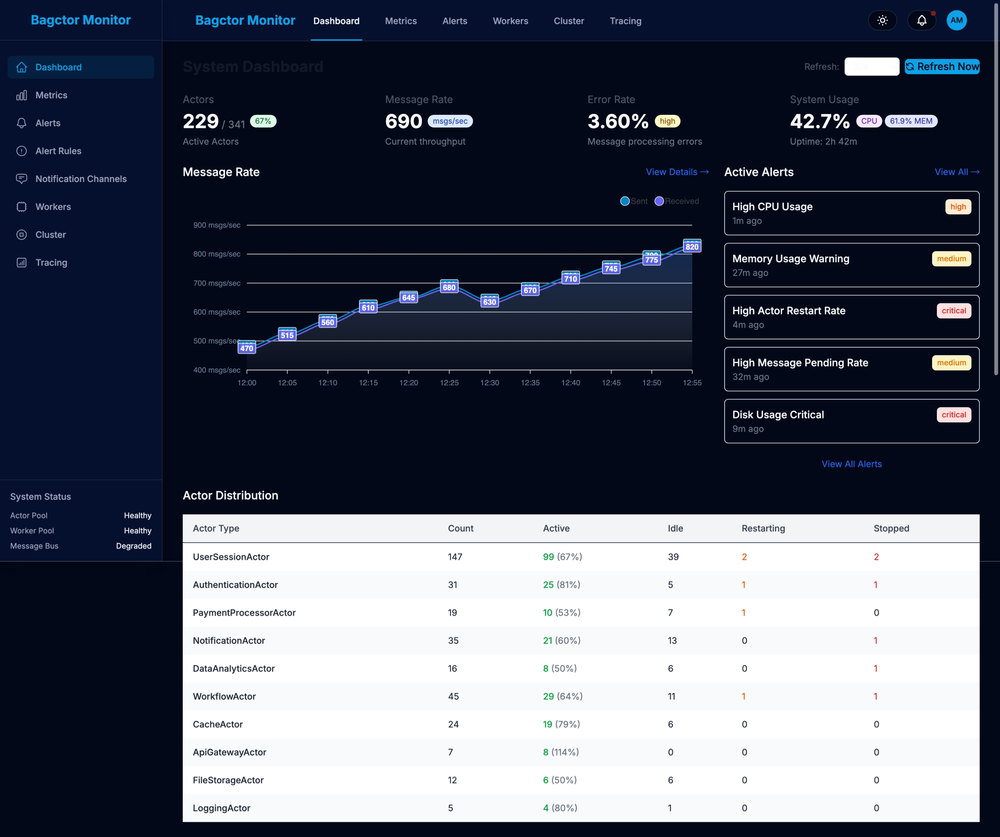
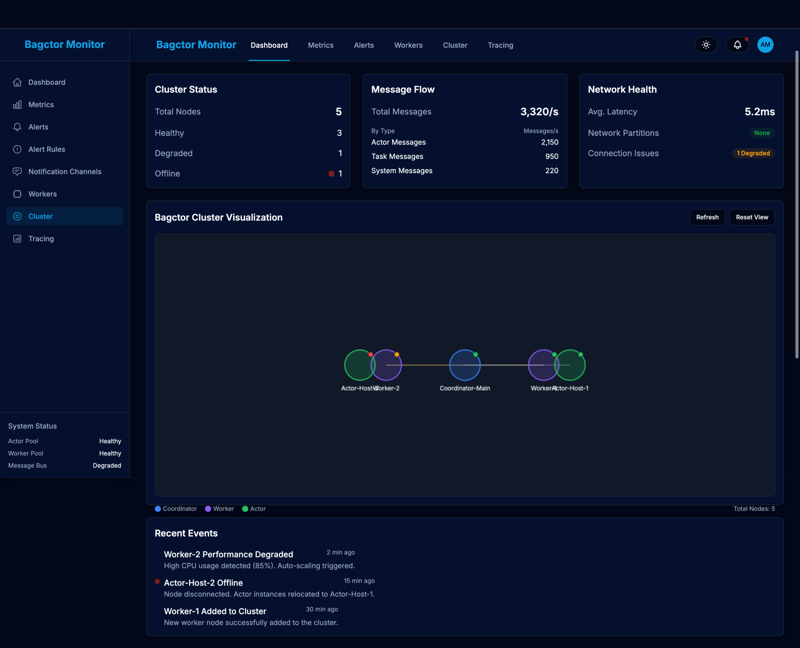
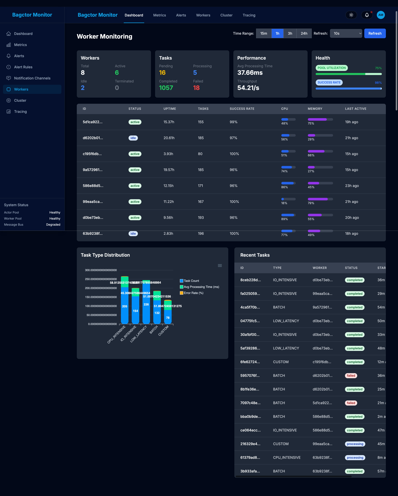

# Bagctor


Bagctor (Bactor + AI Agent) 是一个混合框架，结合了Actor模型与AI Agent能力，用于构建智能的分布式系统。它无缝集成传统的基于Actor的并发模型与现代AI agent架构，使开发者能够构建可扩展、响应式和智能化的应用程序。

<div align="center">
  
</div>

## 特性

- **分布式Actor模型**: 实现轻量级并发与消息传递
- **AI Agent框架**: 提供与Actor模型集成的智能代理
- **集群管理**: 自动节点发现、故障检测和恢复
- **一致性哈希放置**: 智能的Actor位置管理
- **背压机制**: 系统过载保护
- **可观测性**: 完整的性能监控和状态追踪

## 系统架构

<div align="center">
  
</div>

Bagctor的集群架构基于libp2p实现，包含以下核心组件：

1. **ClusterManager** - 集群管理核心，协调所有组件工作
2. **LibP2pClusterTransport** - 基于libp2p的节点间通信
3. **FailureDetectionConsensus** - 基于共识的故障检测
4. **ConsistentHashActorPlacement** - 一致性哈希的Actor放置策略
5. **BackpressureManager** - 系统背压管理
6. **SystemMetricsCollector** - 系统指标收集

## 工作流程

<div align="center">
  
</div>

## 快速入门

### 前提条件

- [Node.js](https://nodejs.org/) >= 16.0.0
- [Bun](https://bun.sh/) >= 1.0.0
- [pnpm](https://pnpm.io/) (用于包管理)

### 安装

```bash
# 克隆仓库
git clone https://github.com/yourusername/bagctor.git
cd bagctor

# 安装依赖
bun install
```

### 构建

```bash
# 构建所有包
bun run build

# 构建特定包
bun run build:core
bun run build:agent
```

### 运行示例

```bash
# 运行分布式示例
bun run example:match

# 运行 libp2p 协调器测试
cd packages/core
bun run src/examples/libp2p_coordinator.ts
```

## 项目结构

```
bagctor/
├── packages/
│   ├── core/           # 核心Actor系统实现
│   │   ├── src/
│   │   │   ├── core/     # 核心组件
│   │   │   ├── remote/   # 远程功能
│   │   │   └── examples/ # 示例代码
│   │   └── package.json
│   │
│   ├── agent/          # AI Agent框架
│   │   ├── src/
│   │   │   ├── agents/   # AI Agent实现
│   │   │   └── types.ts  # Agent系统类型
│   │   └── package.json
│   │
│   └── cluster/        # 集群管理功能
│       ├── src/
│       │   ├── transport/  # 传输层实现
│       │   └── system/     # 集群系统组件
│       └── package.json
├── docs/
│   └── img/            # 文档图片
├── package.json        # 工作区管理
└── bunfig.toml         # Bun配置
```

## 核心组件

### @bagctor/core

核心 Actor 系统提供:

- **Actor模型基础设施**: 消息传递、生命周期管理、状态管理等
- **消息路由系统**: 轮询路由器、随机路由器、广播路由器等
- **分发系统**: 默认分发器、线程池分发器、吞吐量分发器
- **邮箱系统**: 默认邮箱(FIFO)、优先级邮箱、自定义队列支持
- **远程通信**: 支持远程Actor创建和管理

### @bagctor/agent

AI Agent 框架提供:

- **Agent抽象层**: 基于Actor模型的Agent基类、AI消息处理框架等
- **专用AI代理**: 规划代理、执行代理、审查代理等
- **代理协调**: 任务分解和分配、结果聚合、错误处理和恢复

### @bagctor/cluster

集群管理功能提供:

- **集群管理**: 基于libp2p的节点间通信
- **故障检测**: 基于共识的分布式故障检测
- **Actor放置**: 一致性哈希的Actor位置管理
- **指标收集**: 系统性能和状态监控
- **背压管理**: 系统过载保护机制

## 使用示例

### 创建简单Actor

```typescript
import { Actor, PropsBuilder, ActorSystem } from '@bagctor/core';

// 创建Actor系统
const system = new ActorSystem();

// 定义Actor类
class GreetingActor extends Actor {
  protected initializeBehaviors(): void {
    this.addBehavior('default', async (message) => {
      console.log(`Hello, ${message.payload}!`);
    });
  }
}

// 创建Actor实例
const props = PropsBuilder.fromClass(GreetingActor).build();
const pid = await system.spawn(props);

// 发送消息
await system.send(pid, { type: 'greet', payload: 'World' });
```

### 使用分布式集群

```typescript
import { LibP2pClusterTransport, ClusterManager } from '@bagctor/cluster';

// 创建集群管理器
const clusterManager = new ClusterManager();

// 创建传输层
const transport = new LibP2pClusterTransport({
  clusterManager,
  nodeId: "node-1",
  localAddress: "/ip4/127.0.0.1/tcp/40000"
});

// 启动传输层
await transport.start();

// 加入集群
await transport.joinCluster();

// 广播消息
await transport.broadcast({
  type: "STATUS_UPDATE",
  nodeId: "node-1",
  timestamp: Date.now(),
  payload: { status: "READY" }
});
```

## 技术规格

### 运行要求
- Node.js >= 16.0.0
- Bun >= 1.0.0

### 依赖版本
- TypeScript >= 5.0.0
- libp2p
- noise 加密
- Ed25519 密钥

### 性能指标
- Actor消息处理延迟 < 1ms
- Actor消息吞吐量 > 100K/s
- AI Agent响应时间: 基于模型配置
- 内存占用 < 100MB (不包括AI模型)

## 故障排除

### libp2p配置问题

如果遇到 "privateKey not set" 错误，请检查:
1. PeerId 对象是否正确创建和传递
2. 配置参数是否符合最新的 libp2p API 格式
3. 密钥生成和传递方式是否适配您的环境

常见解决方案:
```typescript
// 确保在配置中正确设置privateKey
const config = {
  peerId, // 直接使用完整的PeerId对象
  addresses: {
    listen: ['/ip4/127.0.0.1/tcp/40000']
  },
  connectionEncrypters: [noise()],
  streamMuxers: [mplex()],
  services: {
    identify: identify(),
    pubsub: gossipsub()
  }
};
```

### 连接问题

如果节点无法相互发现或连接:
1. 确认监听地址配置正确
2. 检查网络环境是否支持P2P连接
3. 尝试使用引导节点辅助连接

## 当前状态

所有计划的集群功能已完成实现:

- ✅ libp2p通信层
- ✅ 分布式故障检测
- ✅ 一致性哈希Actor放置
- ✅ 实时系统指标监控
- ✅ 背压策略管理
- ✅ 集群感知的Actor系统集成

## 未来路线图

### 核心增强
- [ ] 带AI驱动负载均衡的集群支持
- [ ] 智能持久化策略
- [ ] AI增强性能监控
- [ ] 智能故障转移机制

### AI Agent系统扩展
- [ ] 额外专用AI代理
- [ ] 知识图谱集成
- [ ] 多模型支持与模型切换
- [ ] 联邦学习能力

### 工具和生态系统
- [ ] AI驱动CLI工具
- [ ] 智能可视化仪表板
- [ ] 带AI集成的示例应用
- [ ] 自定义AI模型插件系统

## 贡献

1. Fork项目
2. 创建你的特性分支 (`git checkout -b feature/amazing-feature`)
3. 提交你的更改 (`git commit -m 'feat: add amazing feature'`)
4. 推送到分支 (`git push origin feature/amazing-feature`)
5. 打开Pull Request

## 许可证

MIT

## 联系

- 项目首页: [GitHub](https://github.com/yourusername/bagctor)
- 问题追踪: [Issues](https://github.com/yourusername/bagctor/issues)
