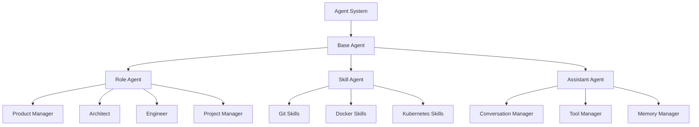
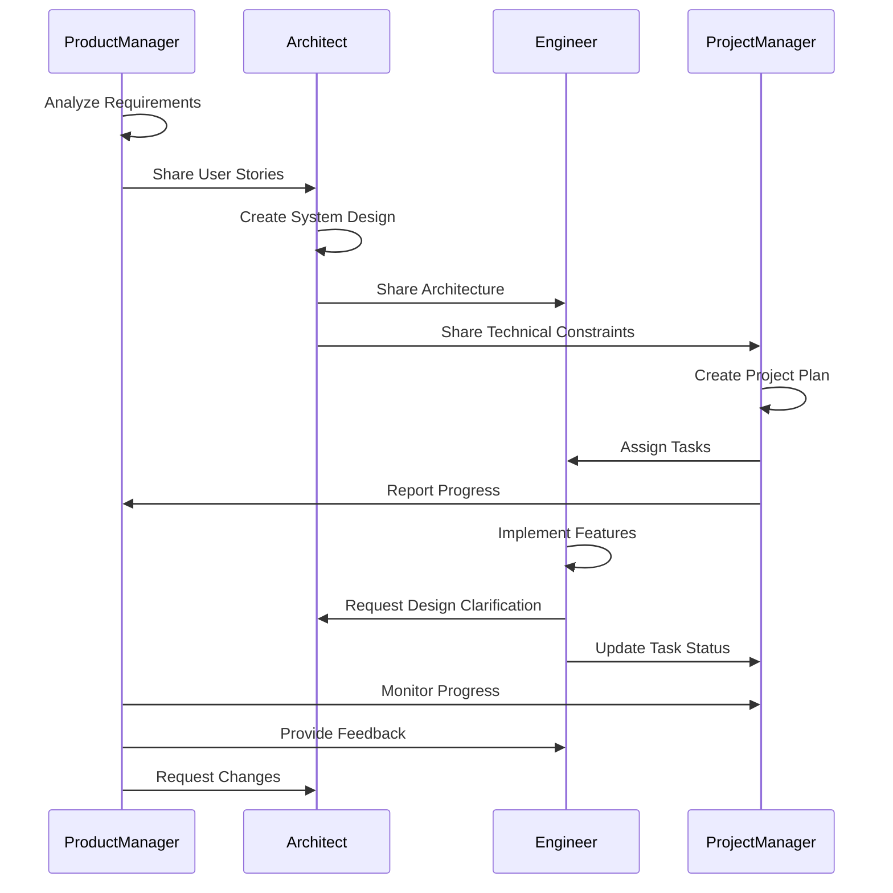

# Bactor Agent System Plan

## Overview

Bactor Agent System is a MetaGPT-style multi-agent framework built on top of the Bactor actor system. It enables the creation of collaborative software entities composed of multiple specialized agents that work together to accomplish complex tasks.

## Architecture

### Core Components

1. **Base Agent**
   - Foundation for all agent types
   - Message handling system
   - Memory management
   - Behavior management
   - Communication protocols

2. **Agent Types**
   - **RoleAgent**: Role-based agents (e.g., Developer, Architect)
   - **SkillAgent**: Capability-based agents (e.g., Git, Docker)
   - **AssistantAgent**: General-purpose assistant with conversation abilities
   - **ProductManager**: Requirements and user story management
   - **Architect**: System design and architecture decisions
   - **Engineer**: Implementation and coding
   - **ProjectManager**: Task coordination and progress tracking

3. **Agent System**
   - Agent lifecycle management
   - Inter-agent communication
   - Resource management
   - Task distribution and coordination

### System Design



## Features

### 1. Role-Based Agents
- Specialized behaviors based on role
- Role-specific task processing
- Adaptive learning from feedback
- Inter-role coordination

### 2. Skill-Based Agents
- Modular skill registration
- Skill execution and management
- Performance monitoring
- Skill coordination

### 3. Assistant Agents
- Natural language understanding
- Context-aware responses
- Tool integration
- Conversation history management

### 4. Team Collaboration
- Task delegation
- Progress monitoring
- Resource sharing
- Knowledge synchronization

## API

### Agent Creation
```typescript
// Create a role-based agent
const roleConfig: AgentConfig = {
  role: 'developer',
  capabilities: ['coding', 'debugging', 'testing']
};
const developer = await system.spawn({
  producer: props => new RoleAgent(props, roleConfig)
});

// Create a skill-based agent
const skillConfig: AgentConfig = {
  role: 'toolsmith',
  capabilities: ['git', 'docker']
};
const toolsmith = await system.spawn({
  producer: props => new SkillAgent(props, skillConfig)
});
```

### Message Types
```typescript
interface AgentMessage {
  type: MessageType;
  sender: PID;
  timestamp: number;
  payload: any;
}

type MessageType = 
  | 'TASK'
  | 'RESULT'
  | 'FEEDBACK'
  | 'COORDINATION'
  | 'ERROR';
```

### Task Execution
```typescript
// Send a task to an agent
await system.send(agentPid, {
  type: 'TASK',
  sender: { id: 'system' },
  payload: {
    description: 'Implement feature X',
    requirements: ['Must be tested', 'Must be documented']
  }
});
```

### Action Role Message Types

```typescript
interface ActionMessage extends AgentMessage {
  type: ActionMessageType;
  payload: ActionPayload;
}

type ActionMessageType =
  | 'REQUIREMENT_ANALYSIS'
  | 'SYSTEM_DESIGN'
  | 'IMPLEMENTATION'
  | 'PROJECT_UPDATE'
  | 'FEEDBACK'
  | 'CLARIFICATION_REQUEST'
  | 'DESIGN_CHANGE'
  | 'STATUS_UPDATE';

type ActionPayload =
  | RequirementAnalysis
  | SystemDesign
  | Implementation
  | ProjectPlan
  | Task
  | FeedbackMessage
  | ClarificationRequest
  | DesignChange;
```

### Role Actions Interface Design

```typescript
// 1. Base Action Interface
interface Action {
  id: string;
  type: ActionType;
  status: ActionStatus;
  priority: Priority;
  context: ActionContext;
  metadata: Record<string, any>;
}

type ActionType = 
  | 'ANALYZE_REQUIREMENT'
  | 'CREATE_USER_STORY'
  | 'DESIGN_ARCHITECTURE'
  | 'IMPLEMENT_FEATURE'
  | 'WRITE_TEST'
  | 'REVIEW_CODE'
  | 'UPDATE_DOCUMENT'
  | 'TRACK_PROGRESS'
  | 'MANAGE_RISK';

type ActionStatus = 
  | 'PENDING'
  | 'IN_PROGRESS'
  | 'BLOCKED'
  | 'COMPLETED'
  | 'FAILED';

interface ActionContext {
  role: string;
  dependencies: string[];
  resources: string[];
  constraints: string[];
  deadline?: Date;
}

// 2. Role-Specific Actions

// Product Manager Actions
interface RequirementAnalysisAction extends Action {
  type: 'ANALYZE_REQUIREMENT';
  input: {
    rawRequirement: string;
    context: string;
    constraints: string[];
  };
  output?: RequirementAnalysis;
}

interface UserStoryCreationAction extends Action {
  type: 'CREATE_USER_STORY';
  input: {
    requirement: RequirementAnalysis;
    scope: string;
  };
  output?: UserStory[];
}

// Architect Actions
interface ArchitectureDesignAction extends Action {
  type: 'DESIGN_ARCHITECTURE';
  input: {
    requirements: RequirementAnalysis;
    userStories: UserStory[];
    constraints: string[];
  };
  output?: SystemDesign;
}

interface APIDesignAction extends Action {
  type: 'DESIGN_API';
  input: {
    systemDesign: SystemDesign;
    requirements: string[];
  };
  output?: APISpec[];
}

// Engineer Actions
interface ImplementationAction extends Action {
  type: 'IMPLEMENT_FEATURE';
  input: {
    userStory: UserStory;
    design: SystemDesign;
    constraints: string[];
  };
  output?: Implementation;
}

interface TestingAction extends Action {
  type: 'WRITE_TEST';
  input: {
    implementation: Implementation;
    requirements: string[];
    coverage: number;
  };
  output?: {
    testFiles: string[];
    coverage: number;
    results: TestResult[];
  };
}

// Project Manager Actions
interface TaskManagementAction extends Action {
  type: 'MANAGE_TASK';
  input: {
    tasks: Task[];
    resources: string[];
    constraints: string[];
  };
  output?: {
    assignments: TaskAssignment[];
    timeline: string; // Gantt chart
  };
}

interface ProgressTrackingAction extends Action {
  type: 'TRACK_PROGRESS';
  input: {
    projectPlan: ProjectPlan;
    currentStatus: Record<string, TaskStatus>;
  };
  output?: {
    progress: number;
    blockers: string[];
    recommendations: string[];
  };
}

// 3. Action Handlers
interface ActionHandler<T extends Action> {
  canHandle(action: Action): boolean;
  handle(action: T): Promise<void>;
  rollback(action: T): Promise<void>;
  getStatus(action: T): ActionStatus;
}

// 4. Action Pipeline
interface ActionPipeline {
  actions: Action[];
  currentIndex: number;
  status: PipelineStatus;
  
  addAction(action: Action): void;
  removeAction(actionId: string): void;
  executeNext(): Promise<void>;
  rollback(): Promise<void>;
  getProgress(): number;
}

type PipelineStatus = 
  | 'READY'
  | 'RUNNING'
  | 'PAUSED'
  | 'COMPLETED'
  | 'FAILED';

// 5. Action Coordination
interface ActionCoordinator {
  scheduleAction(action: Action): Promise<void>;
  cancelAction(actionId: string): Promise<void>;
  pauseAction(actionId: string): Promise<void>;
  resumeAction(actionId: string): Promise<void>;
  getActionStatus(actionId: string): Promise<ActionStatus>;
  getDependencies(actionId: string): Promise<Action[]>;
}

// 6. Action Results
interface ActionResult<T = any> {
  actionId: string;
  status: ActionStatus;
  output?: T;
  error?: Error;
  metrics: {
    startTime: Date;
    endTime?: Date;
    duration?: number;
    resourceUsage: Record<string, number>;
  };
}

// 7. Example Usage
```typescript
// Create a new requirement analysis action
const analyzeAction: RequirementAnalysisAction = {
  id: 'REQ-001',
  type: 'ANALYZE_REQUIREMENT',
  status: 'PENDING',
  priority: 'high',
  context: {
    role: 'product_manager',
    dependencies: [],
    resources: ['market_data', 'user_feedback'],
    constraints: ['deadline: 2d']
  },
  input: {
    rawRequirement: 'Build a CLI tool for task management',
    context: 'Developer productivity tools',
    constraints: ['Must be cross-platform']
  },
  metadata: {
    creator: 'PM-001',
    createdAt: new Date()
  }
};

// Handle the action
class RequirementAnalysisHandler implements ActionHandler<RequirementAnalysisAction> {
  async handle(action: RequirementAnalysisAction): Promise<void> {
    // 1. Parse raw requirement
    // 2. Analyze market and competition
    // 3. Create detailed analysis
    // 4. Update action status and output
  }
  
  async rollback(action: RequirementAnalysisAction): Promise<void> {
    // Cleanup and restore previous state
  }
}
```

## Implementation Plan

### Phase 1: Core Framework
- [x] Base Agent implementation
- [x] Message handling system
- [x] Basic agent types (Role, Skill, Assistant)
- [x] Agent system integration with Bactor

### Phase 2: Specialized Agents
- [ ] Product Manager implementation
- [ ] Architect implementation
- [ ] Engineer implementation
- [ ] Project Manager implementation

### Phase 3: Advanced Features
- [ ] Agent collaboration patterns
- [ ] Learning and adaptation
- [ ] Performance monitoring
- [ ] Error handling and recovery

### Phase 4: Tools and Integration
- [ ] Code generation tools
- [ ] Documentation tools
- [ ] Testing tools
- [ ] Deployment tools

## Examples

### Basic Usage
```typescript
import { ActorSystem } from '@bactor/core';
import { RoleAgent, SkillAgent, AssistantAgent } from '@bactor/agent';

async function main() {
  const system = new ActorSystem();
  await system.start();

  // Create a team of agents
  const team = {
    developer: await createDeveloper(system),
    toolsmith: await createToolsmith(system),
    assistant: await createAssistant(system)
  };

  // Execute a project
  await executeProject(team, {
    description: 'Build a CLI tool',
    requirements: [
      'Must be user-friendly',
      'Must have good documentation'
    ]
  });

  await system.stop();
}
```

### Complex Workflow
```typescript
async function executeProject(team: AgentTeam, project: Project) {
  // 1. Product Manager analyzes requirements
  const userStories = await team.productManager.analyzeRequirements(project);

  // 2. Architect designs the system
  const design = await team.architect.createDesign(userStories);

  // 3. Engineer implements the solution
  const implementation = await team.engineer.implement(design);

  // 4. Project Manager tracks progress
  await team.projectManager.trackProgress({
    userStories,
    design,
    implementation
  });
}
```

## Integration with Bactor

The agent system leverages Bactor's core features:

1. **Actor Model**
   - Agents as actors
   - Message-based communication
   - Supervision and lifecycle management

2. **Behavior System**
   - Role-specific behaviors
   - Skill execution
   - Message handling

3. **Remote Capabilities**
   - Distributed agent deployment
   - Remote communication
   - System scaling

## Future Enhancements

1. **AI Integration**
   - LLM-powered agents
   - Natural language processing
   - Automated code generation

2. **Workflow Optimization**
   - Smart task routing
   - Resource optimization
   - Performance analytics

3. **Tool Integration**
   - Version control integration
   - CI/CD pipeline integration
   - Cloud service integration

4. **Security**
   - Agent authentication
   - Permission management
   - Secure communication

## Action Role API Design

### 1. Product Manager Role

```typescript
interface UserStory {
  id: string;
  title: string;
  description: string;
  priority: 'high' | 'medium' | 'low';
  acceptanceCriteria: string[];
  dependencies?: string[];
}

interface RequirementAnalysis {
  userStories: UserStory[];
  marketAnalysis: {
    competitors: string[];
    uniqueSellingPoints: string[];
    targetUsers: string[];
  };
  feasibilityAnalysis: {
    technicalRisks: string[];
    resourceRequirements: string[];
    timeline: string;
  };
}

interface ProductManagerConfig extends AgentConfig {
  role: 'product_manager';
  capabilities: [
    'requirement_analysis',
    'user_story_creation',
    'market_research',
    'feature_prioritization'
  ];
  parameters: {
    analysisDepth: 'basic' | 'detailed' | 'comprehensive';
    marketFocus: string[];
    prioritizationCriteria: string[];
  };
}
```

### 2. Architect Role

```typescript
interface SystemDesign {
  architecture: {
    components: {
      name: string;
      responsibility: string;
      dependencies: string[];
      apis: APISpec[];
    }[];
    dataFlow: string; // Mermaid diagram
    deployment: string; // Mermaid diagram
  };
  dataStructures: {
    name: string;
    fields: {
      name: string;
      type: string;
      description: string;
    }[];
    relationships: string[]; // Mermaid ER diagram
  }[];
  apis: APISpec[];
}

interface APISpec {
  endpoint: string;
  method: 'GET' | 'POST' | 'PUT' | 'DELETE';
  parameters: {
    name: string;
    type: string;
    required: boolean;
    description: string;
  }[];
  responses: {
    status: number;
    description: string;
    schema: any;
  }[];
}

interface ArchitectConfig extends AgentConfig {
  role: 'architect';
  capabilities: [
    'system_design',
    'api_design',
    'data_modeling',
    'security_planning'
  ];
  parameters: {
    architectureStyle: 'microservices' | 'monolithic' | 'serverless';
    securityLevel: 'basic' | 'advanced' | 'enterprise';
    scalabilityRequirements: string[];
  };
}
```

### 3. Engineer Role

```typescript
interface Implementation {
  files: {
    path: string;
    content: string;
    dependencies: string[];
    tests: string[];
  }[];
  tests: {
    path: string;
    type: 'unit' | 'integration' | 'e2e';
    coverage: number;
  }[];
  documentation: {
    setup: string;
    usage: string;
    api: string;
    examples: string[];
  };
}

interface EngineerConfig extends AgentConfig {
  role: 'engineer';
  capabilities: [
    'coding',
    'testing',
    'debugging',
    'documentation'
  ];
  parameters: {
    codingStyle: string;
    testingFramework: string;
    documentationFormat: string;
    qualityMetrics: {
      minTestCoverage: number;
      maxComplexity: number;
      minDocumentationCoverage: number;
    };
  };
}
```

### 4. Project Manager Role

```typescript
interface ProjectPlan {
  phases: {
    name: string;
    tasks: Task[];
    startDate: string;
    endDate: string;
    dependencies: string[];
    resources: string[];
    milestones: string[];
  }[];
  timeline: string; // Gantt chart in Mermaid
  risks: {
    description: string;
    impact: 'high' | 'medium' | 'low';
    mitigation: string;
  }[];
  resources: {
    name: string;
    role: string;
    availability: number;
    skills: string[];
  }[];
}

interface Task {
  id: string;
  title: string;
  description: string;
  assignee: string;
  status: 'todo' | 'in_progress' | 'review' | 'done';
  priority: 'high' | 'medium' | 'low';
  estimatedHours: number;
  dependencies: string[];
}

interface ProjectManagerConfig extends AgentConfig {
  role: 'project_manager';
  capabilities: [
    'project_planning',
    'resource_management',
    'risk_management',
    'progress_tracking'
  ];
  parameters: {
    methodologies: ('agile' | 'waterfall' | 'hybrid')[];
    reportingFrequency: 'daily' | 'weekly' | 'biweekly';
    riskManagementLevel: 'basic' | 'detailed' | 'comprehensive';
  };
}
```

### Action Role Interaction Flow



### Action Role Message Types

```typescript
interface ActionMessage extends AgentMessage {
  type: ActionMessageType;
  payload: ActionPayload;
}

type ActionMessageType =
  | 'REQUIREMENT_ANALYSIS'
  | 'SYSTEM_DESIGN'
  | 'IMPLEMENTATION'
  | 'PROJECT_UPDATE'
  | 'FEEDBACK'
  | 'CLARIFICATION_REQUEST'
  | 'DESIGN_CHANGE'
  | 'STATUS_UPDATE';

type ActionPayload =
  | RequirementAnalysis
  | SystemDesign
  | Implementation
  | ProjectPlan
  | Task
  | FeedbackMessage
  | ClarificationRequest
  | DesignChange;
``` 