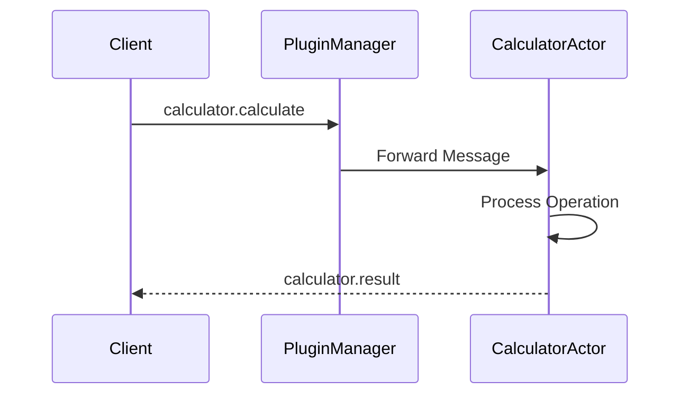

# Calculator Plugin for BActor

A simple calculator plugin that demonstrates the BActor plugin system capabilities.

## Overview

The Calculator Plugin is a sample implementation that showcases how to build plugins for the BActor framework. It provides basic arithmetic operations (addition, subtraction, multiplication, and division) with configurable precision and operand limits.

## Architecture

### Plugin Structure
```
calculator-plugin/
├── package.json        # Plugin package definition and dependencies
├── tsconfig.json      # TypeScript configuration
├── README.md          # Documentation
└── src/
    ├── index.ts       # Plugin implementation
    ├── types.ts       # Type definitions
    └── plugin.json    # Plugin metadata
```

### Components

1. **Plugin Metadata** (`plugin.json`)
   - Defines plugin identity and capabilities
   - Specifies configuration defaults
   - Declares plugin type and dependencies

2. **Type Definitions** (`types.ts`)
   - `CalculatorConfig`: Plugin configuration interface
   - `CalculatorOperation`: Operation request format
   - `CalculatorResult`: Operation result format
   - Message type definitions for type safety

3. **Plugin Implementation** (`index.ts`)
   - `CalculatorActor`: Main plugin actor class
   - Message handlers for arithmetic operations
   - Error handling and logging
   - Configuration management

### Message Flow



## Installation

1. Add the plugin to your BActor project:
```bash
bun add @bactor/calculator-plugin
```

2. Build the plugin:
```bash
bun run build
```

## Configuration

The plugin supports the following configuration options in `plugin.json`:

```json
{
  "precision": 2,      // Number of decimal places in results
  "maxOperands": 10    // Maximum number of operands per operation
}
```

## Usage

### Basic Example

```typescript
// Send a calculation request
await system.send(pluginManager, {
    type: 'calculator.calculate',
    payload: {
        pluginId: 'calculator',
        operation: 'add',
        operands: [1, 2, 3]
    },
    sender: yourActor
});
```

### Supported Operations

1. Addition (`add`)
   ```typescript
   {
       operation: 'add',
       operands: [1, 2, 3]  // Result: 6
   }
   ```

2. Subtraction (`subtract`)
   ```typescript
   {
       operation: 'subtract',
       operands: [10, 3, 2]  // Result: 5
   }
   ```

3. Multiplication (`multiply`)
   ```typescript
   {
       operation: 'multiply',
       operands: [2, 3, 4]  // Result: 24
   }
   ```

4. Division (`divide`)
   ```typescript
   {
       operation: 'divide',
       operands: [100, 2, 2]  // Result: 25
   }
   ```

### Response Format

Success Response:
```typescript
{
    type: 'calculator.result',
    payload: {
        success: true,
        result: number,
        operation: string,
        operands: number[]
    }
}
```

Error Response:
```typescript
{
    type: 'calculator.result',
    payload: {
        success: false,
        error: string
    }
}
```

## Error Handling

The plugin handles various error conditions:

1. Invalid number of operands
2. Division by zero
3. Unsupported operations
4. Configuration violations

## Development

### Prerequisites

- Bun runtime
- TypeScript
- BActor framework

### Building

```bash
# Install dependencies
bun install

# Build plugin
bun run build
```

### Testing

```bash
bun test
```

## Plugin Architecture Details

### 1. Actor Model Integration

The plugin follows the Actor Model pattern:
- Isolated state and behavior
- Message-based communication
- Supervisor strategy support
- Non-blocking operations

### 2. Type Safety

Comprehensive TypeScript types ensure:
- Compile-time error detection
- IDE support and autocompletion
- Runtime type validation
- Clear interface contracts

### 3. Configuration Management

Dynamic configuration handling:
- Default values in plugin metadata
- Runtime configuration updates
- Validation and constraints
- Type-safe config interface

### 4. Logging and Monitoring

Built-in logging strategy:
- Operation tracking
- Error reporting
- Performance metrics
- Debug information

### 5. Error Recovery

Robust error handling:
- Graceful degradation
- Detailed error messages
- State recovery
- Client notification

## Best Practices

1. **Message Handling**
   - Validate message format
   - Type-check payloads
   - Handle missing senders
   - Log operations

2. **Configuration**
   - Provide sensible defaults
   - Validate at runtime
   - Document constraints
   - Support updates

3. **Error Handling**
   - Catch all exceptions
   - Provide context
   - Log errors
   - Notify clients

4. **Testing**
   - Unit test operations
   - Test error cases
   - Verify configurations
   - Check message flow

## Contributing

1. Fork the repository
2. Create a feature branch
3. Commit your changes
4. Push to the branch
5. Create a Pull Request

## License

MIT License - see LICENSE file for details 