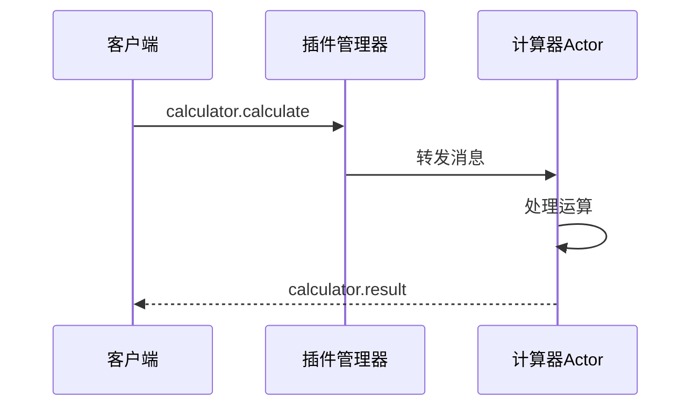

# BActor 计算器插件

一个演示 BActor 插件系统功能的简单计算器插件。

## 概述

计算器插件是一个示例实现，展示了如何为 BActor 框架构建插件。它提供基本的算术运算（加法、减法、乘法和除法），支持可配置的精度和操作数限制。

## 架构

### 插件结构
```
calculator-plugin/
├── package.json        # 插件包定义和依赖
├── tsconfig.json      # TypeScript 配置
├── README.md          # 英文文档
├── README.zh-CN.md    # 中文文档
└── src/
    ├── index.ts       # 插件实现
    ├── types.ts       # 类型定义
    └── plugin.json    # 插件元数据
```

### 组件说明

1. **插件元数据** (`plugin.json`)
   - 定义插件身份和功能
   - 指定配置默认值
   - 声明插件类型和依赖

2. **类型定义** (`types.ts`)
   - `CalculatorConfig`: 插件配置接口
   - `CalculatorOperation`: 操作请求格式
   - `CalculatorResult`: 操作结果格式
   - 消息类型定义，确保类型安全

3. **插件实现** (`index.ts`)
   - `CalculatorActor`: 主插件 Actor 类
   - 算术运算的消息处理器
   - 错误处理和日志记录
   - 配置管理

### 消息流程



## 安装

1. 将插件添加到你的 BActor 项目：
```bash
bun add @bactor/calculator-plugin
```

2. 构建插件：
```bash
bun run build
```

## 配置

插件在 `plugin.json` 中支持以下配置选项：

```json
{
  "precision": 2,      // 结果的小数位数
  "maxOperands": 10    // 每次运算的最大操作数数量
}
```

## 使用方法

### 基本示例

```typescript
// 发送计算请求
await system.send(pluginManager, {
    type: 'calculator.calculate',
    payload: {
        pluginId: 'calculator',
        operation: 'add',
        operands: [1, 2, 3]
    },
    sender: yourActor
});
```

### 支持的运算

1. 加法 (`add`)
   ```typescript
   {
       operation: 'add',
       operands: [1, 2, 3]  // 结果: 6
   }
   ```

2. 减法 (`subtract`)
   ```typescript
   {
       operation: 'subtract',
       operands: [10, 3, 2]  // 结果: 5
   }
   ```

3. 乘法 (`multiply`)
   ```typescript
   {
       operation: 'multiply',
       operands: [2, 3, 4]  // 结果: 24
   }
   ```

4. 除法 (`divide`)
   ```typescript
   {
       operation: 'divide',
       operands: [100, 2, 2]  // 结果: 25
   }
   ```

### 响应格式

成功响应：
```typescript
{
    type: 'calculator.result',
    payload: {
        success: true,
        result: number,      // 计算结果
        operation: string,   // 运算类型
        operands: number[]   // 操作数
    }
}
```

错误响应：
```typescript
{
    type: 'calculator.result',
    payload: {
        success: false,
        error: string       // 错误信息
    }
}
```

## 错误处理

插件处理以下错误情况：

1. 操作数数量无效
2. 除数为零
3. 不支持的运算
4. 配置违规

## 开发指南

### 环境要求

- Bun 运行时
- TypeScript
- BActor 框架

### 构建

```bash
# 安装依赖
bun install

# 构建插件
bun run build
```

### 测试

```bash
bun test
```

## 插件架构详解

### 1. Actor 模型集成

插件遵循 Actor 模型模式：
- 状态和行为隔离
- 基于消息的通信
- 监督策略支持
- 非阻塞操作

### 2. 类型安全

完整的 TypeScript 类型确保：
- 编译时错误检测
- IDE 支持和自动完成
- 运行时类型验证
- 清晰的接口契约

### 3. 配置管理

动态配置处理：
- 元数据中的默认值
- 运行时配置更新
- 验证和约束
- 类型安全的配置接口

### 4. 日志和监控

内置日志策略：
- 操作跟踪
- 错误报告
- 性能指标
- 调试信息

### 5. 错误恢复

健壮的错误处理：
- 优雅降级
- 详细错误消息
- 状态恢复
- 客户端通知

## 最佳实践

1. **消息处理**
   - 验证消息格式
   - 类型检查负载
   - 处理缺失的发送者
   - 记录操作日志

2. **配置管理**
   - 提供合理默认值
   - 运行时验证
   - 文档约束
   - 支持更新

3. **错误处理**
   - 捕获所有异常
   - 提供上下文
   - 记录错误
   - 通知客户端

4. **测试策略**
   - 单元测试操作
   - 测试错误情况
   - 验证配置
   - 检查消息流

## 参与贡献

1. Fork 仓库
2. 创建特性分支
3. 提交更改
4. 推送到分支
5. 创建 Pull Request

## 许可证

MIT 许可证 - 查看 LICENSE 文件了解详情