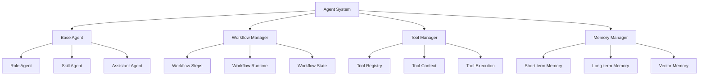

# Bactor-Mastra: AI Agent实现计划

## 1. 总体架构

Bactor-Mastra是一个基于Actor模型的现代AI Agent系统，结合了Bactor的Actor架构和Mastra的工作流设计理念。这个系统允许开发者使用TypeScript构建复杂的、可扩展的AI应用。

### 1.1 核心组件



## 2. 实现方案

### 2.1 Agent结构

基于Mastra的Agent设计，我们将现有的Bactor BaseAgent增强为以下结构：

```typescript
/**
 * Agent配置接口
 */
interface AgentConfig {
  name: string;
  description?: string;
  instructions: string;
  model: LLMModel;
  tools?: Record<string, Tool>;
  memory?: Memory;
  workflow?: Workflow;
}

/**
 * 基础Agent实现
 */
class BactorAgent extends Actor {
  protected config: AgentConfig;
  protected memory: Memory;
  protected tools: ToolRegistry;
  protected llm: LLMService;
  
  constructor(context: ActorContext, config: AgentConfig) {
    super(context);
    this.config = config;
    this.memory = config.memory || new DefaultMemory();
    this.tools = new ToolRegistry();
    this.llm = createLLMService(config.model);
    
    // 注册工具
    if (config.tools) {
      Object.entries(config.tools).forEach(([name, tool]) => {
        this.tools.register(name, tool);
      });
    }
    
    // 设置行为
    this.setupBehaviors();
  }
  
  protected setupBehaviors(): void {
    // 处理生成请求
    this.addBehavior('generate', async (message) => {
      return await this.generate(message.content);
    });
    
    // 处理流式生成请求
    this.addBehavior('streamGenerate', async (message) => {
      return await this.streamGenerate(message.content, message.callback);
    });
    
    // 处理工具调用
    this.addBehavior('executeTool', async (message) => {
      return await this.tools.execute(message.toolName, message.params);
    });
  }
  
  async generate(input: string): Promise<AgentResponse> {
    // 构建上下文
    const context = await this.buildContext(input);
    
    // 调用LLM
    const response = await this.llm.complete({
      messages: context.messages,
      tools: this.tools.getToolDefinitions(),
    });
    
    // 处理工具调用
    if (response.toolCalls && response.toolCalls.length > 0) {
      return await this.handleToolCalls(response.toolCalls, context);
    }
    
    // 更新记忆
    await this.memory.add(input, response.text);
    
    return {
      text: response.text,
      toolCalls: [],
      context: context
    };
  }
  
  async streamGenerate(input: string, callback: (chunk: string) => void): Promise<AgentResponse> {
    // 流式生成实现
    // ...
  }
  
  protected async buildContext(input: string): Promise<AgentContext> {
    // 从记忆中检索相关信息
    const relevantMemories = await this.memory.retrieve(input);
    
    // 构建消息历史
    const messages = [
      { role: 'system', content: this.config.instructions },
      ...relevantMemories.map(m => ({ role: m.role, content: m.content })),
      { role: 'user', content: input }
    ];
    
    return { messages, input };
  }
  
  protected async handleToolCalls(toolCalls: ToolCall[], context: AgentContext): Promise<AgentResponse> {
    // 处理工具调用逻辑
    // ...
  }
}
```

### 2.2 工具系统

基于Mastra的工具系统，我们的实现如下：

```typescript
/**
 * 工具定义
 */
interface Tool {
  id: string;
  name: string;
  description: string;
  parameters: Record<string, ParameterDefinition>;
  execute: (params: any) => Promise<any>;
}

/**
 * 工具参数定义
 */
interface ParameterDefinition {
  type: 'string' | 'number' | 'boolean' | 'array' | 'object';
  description: string;
  required: boolean;
  enum?: any[];
}

/**
 * 工具注册表
 */
class ToolRegistry {
  private tools: Map<string, Tool> = new Map();
  
  register(name: string, tool: Tool): void {
    this.tools.set(name, tool);
  }
  
  async execute(name: string, params: any): Promise<any> {
    const tool = this.tools.get(name);
    if (!tool) {
      throw new Error(`Tool '${name}' not found`);
    }
    
    return await tool.execute(params);
  }
  
  getToolDefinitions(): ToolDefinition[] {
    return Array.from(this.tools.values()).map(tool => ({
      type: 'function',
      function: {
        name: tool.id,
        description: tool.description,
        parameters: this.convertToJsonSchema(tool.parameters)
      }
    }));
  }
  
  private convertToJsonSchema(parameters: Record<string, ParameterDefinition>): any {
    // 转换为OpenAI工具调用格式
    // ...
  }
}

/**
 * 工具创建函数
 */
function createTool(config: ToolConfig): Tool {
  return {
    id: config.id,
    name: config.id,
    description: config.description,
    parameters: config.parameters,
    execute: config.execute
  };
}
```

### 2.3 工作流系统

基于Mastra的工作流设计，结合Bactor的Actor模型：

```typescript
/**
 * 工作流步骤
 */
class Step {
  id: string;
  execute: (context: StepContext) => Promise<any>;
  
  constructor(config: StepConfig) {
    this.id = config.id;
    this.execute = config.execute;
  }
}

/**
 * 工作流定义
 */
class Workflow {
  name: string;
  private steps: Map<string, Step> = new Map();
  private edges: Map<string, string[]> = new Map();
  
  constructor(config: WorkflowConfig) {
    this.name = config.name;
  }
  
  step(stepObj: Step): this {
    this.steps.set(stepObj.id, stepObj);
    return this;
  }
  
  after(fromStepId: string, toStepId: string, condition?: (context: any) => boolean): this {
    const edges = this.edges.get(fromStepId) || [];
    edges.push(toStepId);
    this.edges.set(fromStepId, edges);
    return this;
  }
  
  then(stepObj: Step): this {
    // 当前步骤后添加新步骤
    const lastStepId = [...this.steps.keys()].pop();
    this.step(stepObj);
    if (lastStepId) {
      this.after(lastStepId, stepObj.id);
    }
    return this;
  }
  
  commit(): this {
    // 确认工作流定义
    return this;
  }
  
  createRun(): WorkflowRun {
    return new WorkflowRun(this);
  }
  
  getSteps(): Map<string, Step> {
    return this.steps;
  }
  
  getEdges(): Map<string, string[]> {
    return this.edges;
  }
}

/**
 * 工作流运行时
 */
class WorkflowRun {
  private workflow: Workflow;
  private state: WorkflowState = { 
    status: 'pending',
    steps: {},
    current: null,
    triggerData: null
  };
  
  constructor(workflow: Workflow) {
    this.workflow = workflow;
  }
  
  async start(input: { triggerData: any }): Promise<WorkflowResult> {
    this.state.triggerData = input.triggerData;
    this.state.status = 'running';
    
    // 获取入口步骤（没有入边的步骤）
    const entrySteps = this.findEntrySteps();
    
    // 按顺序执行步骤
    for (const stepId of entrySteps) {
      await this.executeStep(stepId);
    }
    
    this.state.status = 'completed';
    return {
      status: this.state.status,
      steps: this.state.steps,
      output: this.getOutput()
    };
  }
  
  async executeStep(stepId: string): Promise<void> {
    const step = this.workflow.getSteps().get(stepId);
    if (!step) return;
    
    this.state.current = stepId;
    this.state.steps[stepId] = { status: 'running' };
    
    try {
      // 执行步骤
      const output = await step.execute({
        steps: this.state.steps,
        triggerData: this.state.triggerData
      });
      
      // 更新状态
      this.state.steps[stepId] = {
        status: 'success',
        output
      };
      
      // 执行后续步骤
      const nextSteps = this.workflow.getEdges().get(stepId) || [];
      for (const nextStepId of nextSteps) {
        await this.executeStep(nextStepId);
      }
    } catch (error) {
      this.state.steps[stepId] = {
        status: 'error',
        error: error.message
      };
    }
  }
  
  private findEntrySteps(): string[] {
    // 找到没有入边的步骤
    const allStepIds = [...this.workflow.getSteps().keys()];
    const targetStepIds = new Set<string>();
    
    this.workflow.getEdges().forEach((targets) => {
      targets.forEach(target => targetStepIds.add(target));
    });
    
    return allStepIds.filter(id => !targetStepIds.has(id));
  }
  
  private getOutput(): any {
    // 所有成功步骤的输出
    const output: Record<string, any> = {};
    
    Object.entries(this.state.steps).forEach(([stepId, stepState]) => {
      if (stepState.status === 'success') {
        output[stepId] = stepState.output;
      }
    });
    
    return output;
  }
}
```

### 2.4 内存系统

基于Mastra的内存系统：

```typescript
/**
 * 内存条目
 */
interface MemoryEntry {
  id: string;
  role: 'user' | 'assistant' | 'system';
  content: string;
  timestamp: number;
  metadata?: Record<string, any>;
}

/**
 * 内存接口
 */
interface Memory {
  add(input: string, response: string, metadata?: Record<string, any>): Promise<void>;
  retrieve(query: string, options?: RetrieveOptions): Promise<MemoryEntry[]>;
  clear(): Promise<void>;
}

/**
 * 默认内存实现
 */
class DefaultMemory implements Memory {
  private entries: MemoryEntry[] = [];
  
  async add(input: string, response: string, metadata?: Record<string, any>): Promise<void> {
    const timestamp = Date.now();
    
    // 添加用户输入
    this.entries.push({
      id: `user-${timestamp}`,
      role: 'user',
      content: input,
      timestamp,
      metadata
    });
    
    // 添加助手响应
    this.entries.push({
      id: `assistant-${timestamp}`,
      role: 'assistant',
      content: response,
      timestamp,
      metadata
    });
  }
  
  async retrieve(query: string, options: RetrieveOptions = {}): Promise<MemoryEntry[]> {
    const { limit = 10, recency = true } = options;
    
    // 复制并根据时间排序
    let result = [...this.entries];
    
    if (recency) {
      result.sort((a, b) => b.timestamp - a.timestamp);
    }
    
    return result.slice(0, limit);
  }
  
  async clear(): Promise<void> {
    this.entries = [];
  }
}

/**
 * 向量内存实现
 */
class VectorMemory implements Memory {
  private entries: MemoryEntry[] = [];
  private vectors: Map<string, number[]> = new Map();
  private embeddingService: EmbeddingService;
  
  constructor(embeddingService: EmbeddingService) {
    this.embeddingService = embeddingService;
  }
  
  async add(input: string, response: string, metadata?: Record<string, any>): Promise<void> {
    const timestamp = Date.now();
    
    // 添加用户输入
    const userEntry: MemoryEntry = {
      id: `user-${timestamp}`,
      role: 'user',
      content: input,
      timestamp,
      metadata
    };
    this.entries.push(userEntry);
    
    // 添加助手响应
    const assistantEntry: MemoryEntry = {
      id: `assistant-${timestamp}`,
      role: 'assistant',
      content: response,
      timestamp,
      metadata
    };
    this.entries.push(assistantEntry);
    
    // 生成并存储向量嵌入
    const userVector = await this.embeddingService.embed(input);
    const assistantVector = await this.embeddingService.embed(response);
    
    this.vectors.set(userEntry.id, userVector);
    this.vectors.set(assistantEntry.id, assistantVector);
  }
  
  async retrieve(query: string, options: RetrieveOptions = {}): Promise<MemoryEntry[]> {
    const { limit = 10, similarityThreshold = 0.7 } = options;
    
    // 为查询生成向量嵌入
    const queryVector = await this.embeddingService.embed(query);
    
    // 计算相似度并排序
    const similarities: [string, number][] = [];
    
    this.vectors.forEach((vector, id) => {
      const similarity = this.cosineSimilarity(queryVector, vector);
      similarities.push([id, similarity]);
    });
    
    similarities.sort((a, b) => b[1] - a[1]);
    
    // 获取相似度超过阈值的条目
    const relevantIds = new Set(
      similarities
        .filter(([_, similarity]) => similarity >= similarityThreshold)
        .slice(0, limit)
        .map(([id]) => id)
    );
    
    return this.entries.filter(entry => relevantIds.has(entry.id));
  }
  
  async clear(): Promise<void> {
    this.entries = [];
    this.vectors.clear();
  }
  
  private cosineSimilarity(a: number[], b: number[]): number {
    // 计算余弦相似度
    // ...
  }
}
```

### 2.5 LLM服务

参考Mastra的LLM集成模式：

```typescript
/**
 * LLM服务接口
 */
interface LLMService {
  complete(params: CompleteParams): Promise<CompleteResponse>;
  chat(messages: Message[], options?: ChatOptions): Promise<string>;
  streamChat(messages: Message[], callback: (chunk: string) => void, options?: StreamOptions): Promise<void>;
}

/**
 * 创建LLM服务
 */
function createLLMService(model: LLMModel): LLMService {
  // 根据模型类型创建对应的服务实例
  if (model.provider === 'openai') {
    return new OpenAIService(model.name, model.apiKey);
  } else if (model.provider === 'qwen') {
    return new QwenService(model.name, model.apiKey);
  } else {
    // 默认服务或自定义服务
    return new CustomLLMService(model);
  }
}

/**
 * OpenAI服务实现
 */
class OpenAIService implements LLMService {
  private model: string;
  private apiKey: string;
  
  constructor(model: string, apiKey: string) {
    this.model = model;
    this.apiKey = apiKey;
  }
  
  async complete(params: CompleteParams): Promise<CompleteResponse> {
    // 使用OpenAI API
    // ...
  }
  
  async chat(messages: Message[], options?: ChatOptions): Promise<string> {
    // 实现聊天功能
    // ...
  }
  
  async streamChat(messages: Message[], callback: (chunk: string) => void, options?: StreamOptions): Promise<void> {
    // 实现流式聊天
    // ...
  }
}
```

## 3. 集成到Bactor Actor系统

### 3.1 Agent Actor

使用Bactor的Actor系统作为基础，我们将Agent实现为Actor：

```typescript
/**
 * Agent Actor工厂
 */
function createAgentActor(system: ActorSystem, config: AgentConfig): Promise<PID> {
  return system.spawn({
    producer: (context) => new BactorAgent(context, config)
  });
}

/**
 * 创建和使用Agent Actor的示例
 */
async function main() {
  // 创建Actor系统
  const system = new ActorSystem();
  
  // 创建一个Agent Actor
  const weatherAgent = await createAgentActor(system, {
    name: 'Weather Agent',
    instructions: `You are a helpful weather assistant...`,
    model: { provider: 'openai', name: 'gpt-4o-mini', apiKey: process.env.OPENAI_API_KEY },
    tools: {
      getWeather: {
        id: 'get-weather',
        name: 'get-weather',
        description: 'Get current weather for a location',
        parameters: {
          location: {
            type: 'string',
            description: 'City name',
            required: true
          }
        },
        execute: async (params) => {
          // 实现天气查询逻辑
          // ...
        }
      }
    }
  });
  
  // 发送生成请求
  const response = await system.ask(weatherAgent, {
    type: 'generate',
    content: 'What is the weather in London?'
  });
  
  console.log(response);
  
  // 停止系统
  await system.stop(weatherAgent);
}
```

### 3.2 工作流集成

工作流作为一种特殊的Actor，协调多个Agent和步骤：

```typescript
/**
 * 工作流Actor
 */
class WorkflowActor extends Actor {
  private workflow: Workflow;
  private runs: Map<string, WorkflowRun> = new Map();
  
  constructor(context: ActorContext, workflowConfig: WorkflowConfig) {
    super(context);
    this.workflow = new Workflow(workflowConfig);
    this.setupBehaviors();
  }
  
  private setupBehaviors(): void {
    // 处理工作流定义
    this.addBehavior('defineWorkflow', (message) => {
      const { steps, connections } = message;
      
      // 添加步骤
      steps.forEach((stepConfig: StepConfig) => {
        this.workflow.step(new Step(stepConfig));
      });
      
      // 添加连接
      connections.forEach((connection: Connection) => {
        this.workflow.after(connection.from, connection.to, connection.condition);
      });
      
      this.workflow.commit();
      return { success: true };
    });
    
    // 启动工作流
    this.addBehavior('startWorkflow', async (message) => {
      const runId = uuidv4();
      const run = this.workflow.createRun();
      this.runs.set(runId, run);
      
      const result = await run.start({ triggerData: message.input });
      return { runId, result };
    });
    
    // 查询工作流状态
    this.addBehavior('getWorkflowStatus', (message) => {
      const { runId } = message;
      const run = this.runs.get(runId);
      
      if (!run) {
        return { error: `Run with id ${runId} not found` };
      }
      
      return run.getState();
    });
  }
}

/**
 * 创建工作流Actor
 */
function createWorkflowActor(system: ActorSystem, config: WorkflowConfig): Promise<PID> {
  return system.spawn({
    producer: (context) => new WorkflowActor(context, config)
  });
}
```

## 4. 使用示例

### 4.1 简单Agent示例

```typescript
import { ActorSystem } from '@bactor/core';
import { createAgentActor } from '@bactor/agent';

async function main() {
  const system = new ActorSystem();
  
  // 创建一个简单的助手Agent
  const assistantPid = await createAgentActor(system, {
    name: 'Assistant',
    instructions: 'You are a helpful assistant that answers questions.',
    model: { 
      provider: 'openai', 
      name: 'gpt-4o-mini', 
      apiKey: process.env.OPENAI_API_KEY 
    }
  });
  
  // 发送请求并获取响应
  const response = await system.ask(assistantPid, {
    type: 'generate',
    content: 'What is the capital of France?'
  });
  
  console.log(`Response: ${response.text}`);
  
  // 清理
  await system.stop(assistantPid);
}

main().catch(console.error);
```

### 4.2 带工具的Agent示例

```typescript
import { ActorSystem } from '@bactor/core';
import { createAgentActor, createTool } from '@bactor/agent';

async function main() {
  const system = new ActorSystem();
  
  // 创建计算器工具
  const calculatorTool = createTool({
    id: 'calculator',
    description: 'Perform mathematical calculations',
    parameters: {
      operation: {
        type: 'string',
        description: 'Mathematical operation: add, subtract, multiply, divide',
        required: true,
        enum: ['add', 'subtract', 'multiply', 'divide']
      },
      a: {
        type: 'number',
        description: 'First operand',
        required: true
      },
      b: {
        type: 'number',
        description: 'Second operand',
        required: true
      }
    },
    execute: async (params) => {
      const { operation, a, b } = params;
      
      switch (operation) {
        case 'add': return { result: a + b };
        case 'subtract': return { result: a - b };
        case 'multiply': return { result: a * b };
        case 'divide': return { result: a / b };
        default: throw new Error(`Unknown operation: ${operation}`);
      }
    }
  });
  
  // 创建具有计算器工具的Agent
  const mathAgentPid = await createAgentActor(system, {
    name: 'Math Assistant',
    instructions: 'You are a math assistant that can perform calculations.',
    model: { 
      provider: 'openai', 
      name: 'gpt-4o-mini', 
      apiKey: process.env.OPENAI_API_KEY 
    },
    tools: {
      calculator: calculatorTool
    }
  });
  
  // 发送请求并获取响应
  const response = await system.ask(mathAgentPid, {
    type: 'generate',
    content: 'What is 135 * 28?'
  });
  
  console.log(`Response: ${response.text}`);
  console.log(`Tool calls: ${JSON.stringify(response.toolCalls)}`);
  
  // 清理
  await system.stop(mathAgentPid);
}

main().catch(console.error);
```

### 4.3 工作流示例

```typescript
import { ActorSystem } from '@bactor/core';
import { createWorkflowActor, Step } from '@bactor/agent';

async function main() {
  const system = new ActorSystem();
  
  // 创建一个工作流Actor
  const workflowPid = await createWorkflowActor(system, {
    name: 'data-processing-workflow'
  });
  
  // 定义工作流
  await system.ask(workflowPid, {
    type: 'defineWorkflow',
    steps: [
      {
        id: 'fetchData',
        execute: async ({ context }) => {
          // 获取数据
          return { data: [1, 2, 3, 4, 5] };
        }
      },
      {
        id: 'processData',
        execute: async ({ context }) => {
          const { data } = context.steps.fetchData.output;
          // 处理数据
          const processedData = data.map(x => x * 2);
          return { processedData };
        }
      },
      {
        id: 'analyzeData',
        execute: async ({ context }) => {
          const { processedData } = context.steps.processData.output;
          // 分析数据
          const sum = processedData.reduce((a, b) => a + b, 0);
          const average = sum / processedData.length;
          return { sum, average };
        }
      }
    ],
    connections: [
      { from: 'fetchData', to: 'processData' },
      { from: 'processData', to: 'analyzeData' }
    ]
  });
  
  // 启动工作流
  const result = await system.ask(workflowPid, {
    type: 'startWorkflow',
    input: { source: 'example' }
  });
  
  console.log('Workflow result:', result);
  
  // 清理
  await system.stop(workflowPid);
}

main().catch(console.error);
```

## 5. 实施路线图

### 阶段1：基础架构（1-2周）

- 实现基础BactorAgent类，集成到现有Actor系统
- 实现LLM服务接口和基本提供商（OpenAI、Qwen）
- 实现基本的工具系统

### 阶段2：记忆和存储（1-2周）

- 实现基础记忆接口和默认记忆实现
- 添加向量记忆实现
- 集成存储系统用于持久化

### 阶段3：工作流系统（2-3周）

- 实现工作流定义和运行时
- 创建工作流Actor
- 开发工作流状态管理

### 阶段4：示例和文档（1-2周）

- 构建基本示例（简单Agent、带工具的Agent、工作流）
- 编写详细文档
- 创建入门教程

### 阶段5：优化和扩展（2-3周）

- 性能优化
- 添加更多LLM提供商
- 实现高级功能（多Agent协作、复杂工作流）

## 6. 总结

本计划概述了如何将Mastra的Agent设计模式集成到Bactor的Actor架构中，创建一个强大的、基于TypeScript的AI Agent系统。通过结合Actor模型的并发和消息传递能力，以及Mastra的工作流和工具系统，该实现将提供一个灵活、可扩展的平台，用于构建复杂的AI应用。

关键特性包括：
- 基于Actor的Agent实现
- 灵活的工具系统
- 强大的工作流编排
- 多种记忆实现
- 支持多种LLM提供商
- TypeScript优先的API设计
