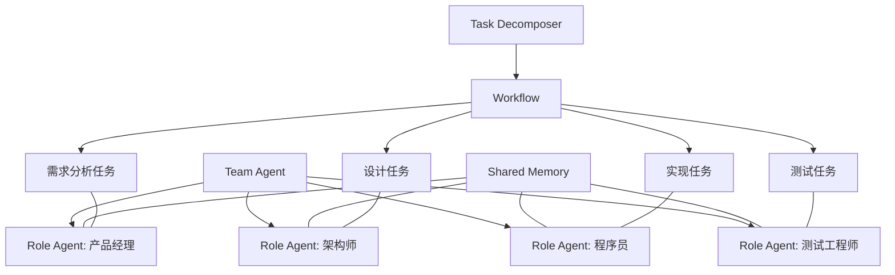

# Bagctor Plan 2.0: 基于Actor架构构建协作式AI Agent系统

## 1. 执行摘要

Bagctor 2.0 将基于现有的Bactor-Mastra集成架构，构建一个完整的协作式AI Agent系统，支持类似MetaGPT的多智能体协作、自主思考和任务执行。本计划详细阐述了系统各组件设计、实现阶段以及关键场景，旨在打造一个灵活强大的分布式AI协作框架。

## 2. 系统架构

### 2.1 多层架构

```mermaid
graph TD
    subgraph "基础设施层"
        AS[Actor System] --> MM[Message Bus]
        AS --> SM[State Management]
        AS --> RM[Resource Management]
    end
    
    subgraph "Agent核心层"
        BA[Base Agent] --> RA[Role Agent]
        BA --> TA[Team Agent]
        BA --> SA[Skill Agent]
        BA --> CA[Coordinator Agent]
    end
    
    subgraph "协作层"
        WF[Workflow Engine] --> PC[Protocol Controller]
        WF --> TC[Task Decomposer]
        WF --> SH[Shared Context]
    end
    
    subgraph "工具与能力层"
        TL[Tool Registry] --> ET[External Tools]
        TL --> IT[Internal Tools]
        MEM[Memory System] --> STM[Short-term Memory]
        MEM --> LTM[Long-term Memory]
        MEM --> VM[Vector Memory]
        LM[LLM Integration] --> MC[Model Catalog]
    end
    
    subgraph "应用层"
        API[API Gateway] --> UI[User Interfaces]
        API --> INT[Integrations]
        API --> SDK[Developer SDK]
    end
    
    "基础设施层" --> "Agent核心层"
    "Agent核心层" --> "协作层"
    "Agent核心层" --> "工具与能力层"
    "协作层" --> "应用层"
```

### 2.2 核心组件关系



## 3. 核心组件详细规格

### 3.1 Agent类型定义

#### 3.1.1 RoleAgent

```typescript
/**
 * 角色Agent配置
 */
export interface RoleAgentConfig extends BactorAgentConfig {
  /** 角色提示 */
  rolePrompt: string;
  /** 角色特定工具 */
  roleTools?: Record<string, Tool<string, any, any>>;
  /** 角色记忆 */
  roleMemory?: Memory;
  /** 角色技能 */
  skills?: string[];
  /** 角色权限 */
  permissions?: string[];
  /** 角色目标 */
  goals?: string[];
}

/**
 * 角色Agent实现
 */
export class RoleAgent extends BactorAgent {
  protected roleConfig: RoleAgentConfig;
  protected skills: Map<string, SkillAgent> = new Map();
  protected goals: string[] = [];

  constructor(context: ActorContext, config: RoleAgentConfig) {
    super(context, {
      ...config,
      instructions: `${config.rolePrompt}\n\n${config.instructions}`
    });
    
    this.roleConfig = config;
    this.goals = config.goals || [];
    
    // 注册角色特定工具
    if (config.roleTools) {
      Object.entries(config.roleTools).forEach(([name, tool]) => {
        this.tools.register(name, tool);
      });
    }
    
    // 设置反射行为
    this.setupReflectionBehavior();
  }

  /**
   * 设置反思和自我改进行为
   */
  protected setupReflectionBehavior(): void {
    this.addBehavior('reflect', async (message) => {
      return await this.reflect(message.content, message.options);
    });
  }

  /**
   * 反思过程实现
   */
  async reflect(content: string, options?: any): Promise<any> {
    const reflectionContext = await this.buildReflectionContext(content);
    const reflection = await this.mastraAgent.generate({
      messages: [
        { role: 'system', content: 'You are analyzing your previous response critically.' },
        { role: 'user', content: reflectionContext }
      ]
    });
    
    await this.updateFromReflection(reflection.text);
    
    return {
      originalContent: content,
      reflection: reflection.text,
      improvements: this.extractImprovements(reflection.text)
    };
  }

  // ... 其他方法实现
}
```

#### 3.1.2 TeamAgent

```typescript
/**
 * 团队Agent配置
 */
export interface TeamAgentConfig extends BactorAgentConfig {
  /** 团队成员配置 */
  members: {
    role: string;
    config: RoleAgentConfig;
  }[];
  /** 工作流配置 */
  workflow?: WorkflowConfig;
  /** 协作协议 */
  collaborationProtocol?: CollaborationProtocol;
  /** 共享记忆 */
  sharedMemory?: Memory;
}

/**
 * 团队Agent实现
 */
export class TeamAgent extends BactorAgent {
  protected teamConfig: TeamAgentConfig;
  protected members: Map<string, PID> = new Map();
  protected workflow?: WorkflowActor;
  protected sharedMemory: Memory;
  
  constructor(context: ActorContext, config: TeamAgentConfig) {
    super(context, config);
    this.teamConfig = config;
    this.sharedMemory = config.sharedMemory || new SharedMemory();
    this.setupTeamBehaviors();
  }
  
  /**
   * 设置团队特定行为
   */
  protected setupTeamBehaviors(): void {
    this.addBehavior('assignTask', async (message) => {
      return await this.assignTask(message.task, message.targetRole);
    });
    
    this.addBehavior('coordinate', async (message) => {
      return await this.coordinateTeam(message.task);
    });
    
    this.addBehavior('synthesize', async (message) => {
      return await this.synthesizeResults(message.results);
    });
  }

  // ... 其他方法实现
}
```

## 4. 实现阶段

### 4.1 阶段一：基础设施（2周）

- [ ] Actor系统核心组件实现
- [ ] 消息总线实现
- [ ] 状态管理系统实现
- [ ] 资源管理系统实现

### 4.2 阶段二：Agent核心层（3周）

- [ ] BaseAgent实现
- [ ] RoleAgent实现
- [ ] TeamAgent实现
- [ ] SkillAgent实现
- [ ] CoordinatorAgent实现

### 4.3 阶段三：协作层（3周）

- [ ] 工作流引擎实现
- [ ] 协议控制器实现
- [ ] 任务分解器实现
- [ ] 共享上下文管理实现

### 4.4 阶段四：工具与能力层（2周）

- [ ] 工具注册表实现
- [ ] 外部工具集成
- [ ] 内部工具开发
- [ ] 记忆系统实现
- [ ] LLM集成实现

### 4.5 阶段五：应用层（2周）

- [ ] API网关实现
- [ ] 用户界面开发
- [ ] SDK开发
- [ ] 集成接口实现

## 5. 关键场景示例

### 5.1 软件开发团队协作

```typescript
// 创建软件开发团队
const devTeam = new TeamAgent(context, {
  name: "Software Development Team",
  members: [
    {
      role: "productManager",
      config: {
        rolePrompt: "你是一名经验丰富的产品经理...",
        skills: ["requirement-analysis", "user-research"]
      }
    },
    {
      role: "architect",
      config: {
        rolePrompt: "你是一名系统架构师...",
        skills: ["system-design", "architecture-review"]
      }
    },
    {
      role: "programmer",
      config: {
        rolePrompt: "你是一名全栈开发工程师...",
        skills: ["coding", "testing", "debugging"]
      }
    }
  ],
  workflow: softwareDevWorkflow,
  sharedMemory: new SharedMemory()
});

// 启动开发任务
await devTeam.coordinateTeam({
  type: "develop-feature",
  description: "实现用户认证系统",
  requirements: [
    "支持邮箱和手机号登录",
    "实现OAuth2集成",
    "提供密码重置功能"
  ]
});
```

### 5.2 研究团队协作

```typescript
// 创建研究团队
const researchTeam = new TeamAgent(context, {
  name: "Research Team",
  members: [
    {
      role: "researcher",
      config: {
        rolePrompt: "你是一名专业研究员...",
        skills: ["literature-review", "data-analysis"]
      }
    },
    {
      role: "writer",
      config: {
        rolePrompt: "你是一名技术文档撰写专家...",
        skills: ["technical-writing", "editing"]
      }
    },
    {
      role: "reviewer",
      config: {
        rolePrompt: "你是一名同行评议专家...",
        skills: ["peer-review", "quality-assurance"]
      }
    }
  ],
  workflow: researchWorkflow,
  sharedMemory: new SharedMemory()
});

// 启动研究任务
await researchTeam.coordinateTeam({
  type: "conduct-research",
  topic: "AI系统中的涌现行为研究",
  deliverables: ["研究报告", "技术博客", "演示文稿"]
});
```

## 6. 技术要求

### 6.1 开发环境

- Node.js >= 18.0.0
- TypeScript >= 4.8.0
- Bun >= 1.0.0

### 6.2 依赖项

- @bactor/core: 最新版本
- @mastra/core: 最新版本
- OpenAI API或其他LLM提供商
- Vector数据库（可选）

### 6.3 部署要求

- 支持分布式部署
- 支持容器化
- 支持云原生架构

## 7. 评估指标

### 7.1 性能指标

- 消息处理延迟 < 100ms
- Agent响应时间 < 2s
- 系统吞吐量 > 1000 TPS

### 7.2 质量指标

- 代码覆盖率 > 85%
- 系统可用性 > 99.9%
- API文档完整度 100%

### 7.3 协作效果指标

- 任务完成准确率 > 90%
- 团队协作效率提升 > 50%
- 知识复用率 > 70%

## 8. 后续规划

### 8.1 短期目标（1-3个月）

- 完成核心功能实现
- 发布第一个稳定版本
- 完成基础文档编写

### 8.2 中期目标（3-6个月）

- 优化性能和稳定性
- 扩展工具和集成能力
- 建立社区和生态系统

### 8.3 长期目标（6-12个月）

- 支持更复杂的协作模式
- 实现自适应学习能力
- 建立完整的评估体系

## 9. 总结

Bagctor 2.0计划通过整合Actor模型和现代AI技术，打造一个强大的协作式AI Agent系统。该系统将支持：

1. 多角色协作
2. 自主思考和改进
3. 灵活的工作流程
4. 知识共享和积累
5. 工具集成和扩展

通过分阶段实施和持续优化，我们将逐步实现一个功能完备、性能优异的AI协作平台。 